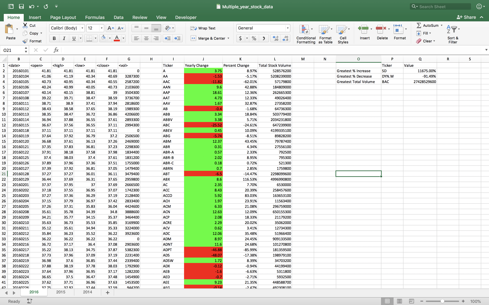
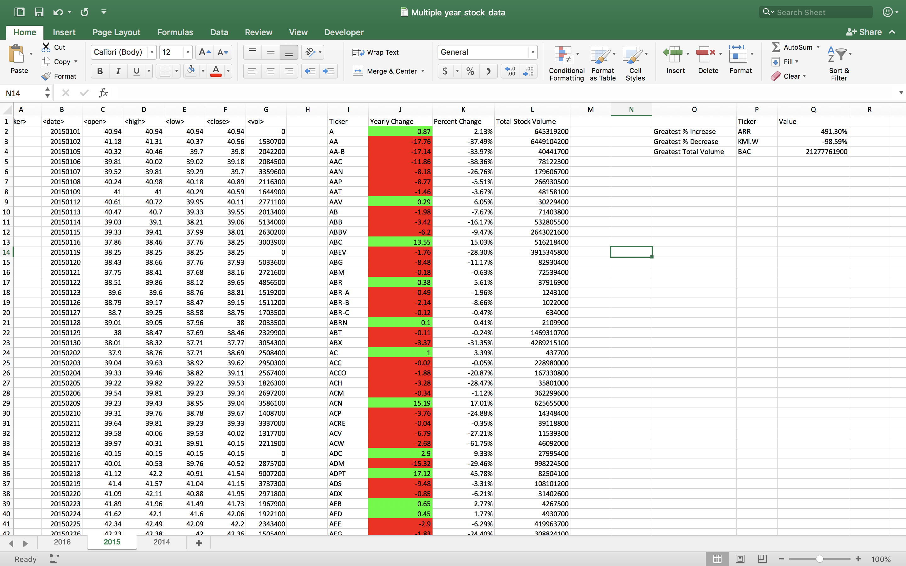
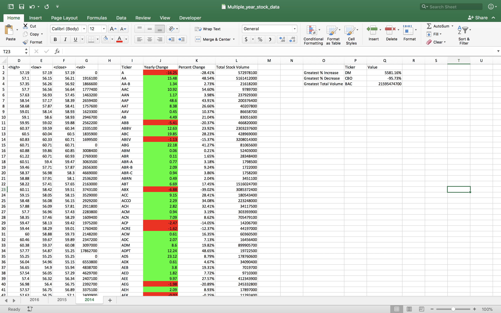

# Multiple-Year-Stock-Data
The VBA of Wall Street

## Easy Section
* Create a script that will loop through each year of stock data and grab the total amount of volume each stock had over the year.
* Display the ticker symbol to coincide with the total volume.

## Moderate Section
* Create a script that will loop through all the stocks and take the following info.
* Yearly change from what the stock opened the year at to what the closing price was.
* The percent change from the what it opened the year at to what it closed.
* The total Volume of the stock
* Ticker symbol
* Add conditional formatting that will highlight positive change in green and negative change in red.

## Hard Section
* Include everything from the moderate challenge.
* Locate the stock with the "Greatest % increase", "Greatest % Decrease" and "Greatest total volume".

### 2016 Analysis Screenshot 

### 2015 Analysis Screenshot 

### 2014 Analysis Screenshot 

